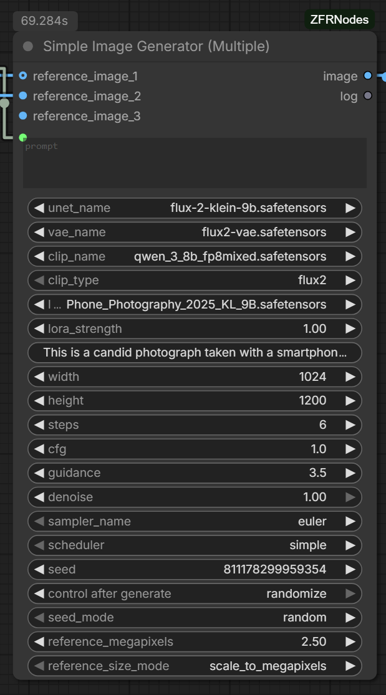
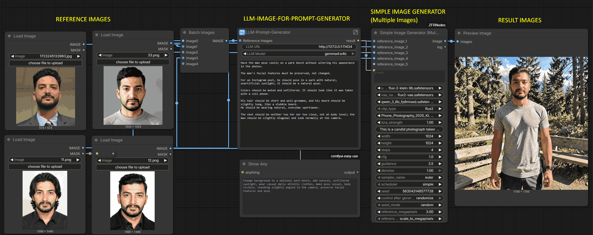
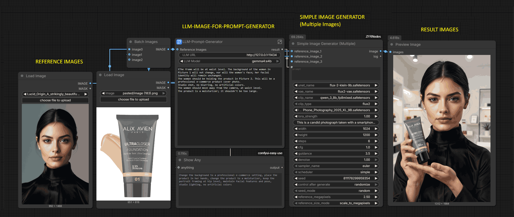
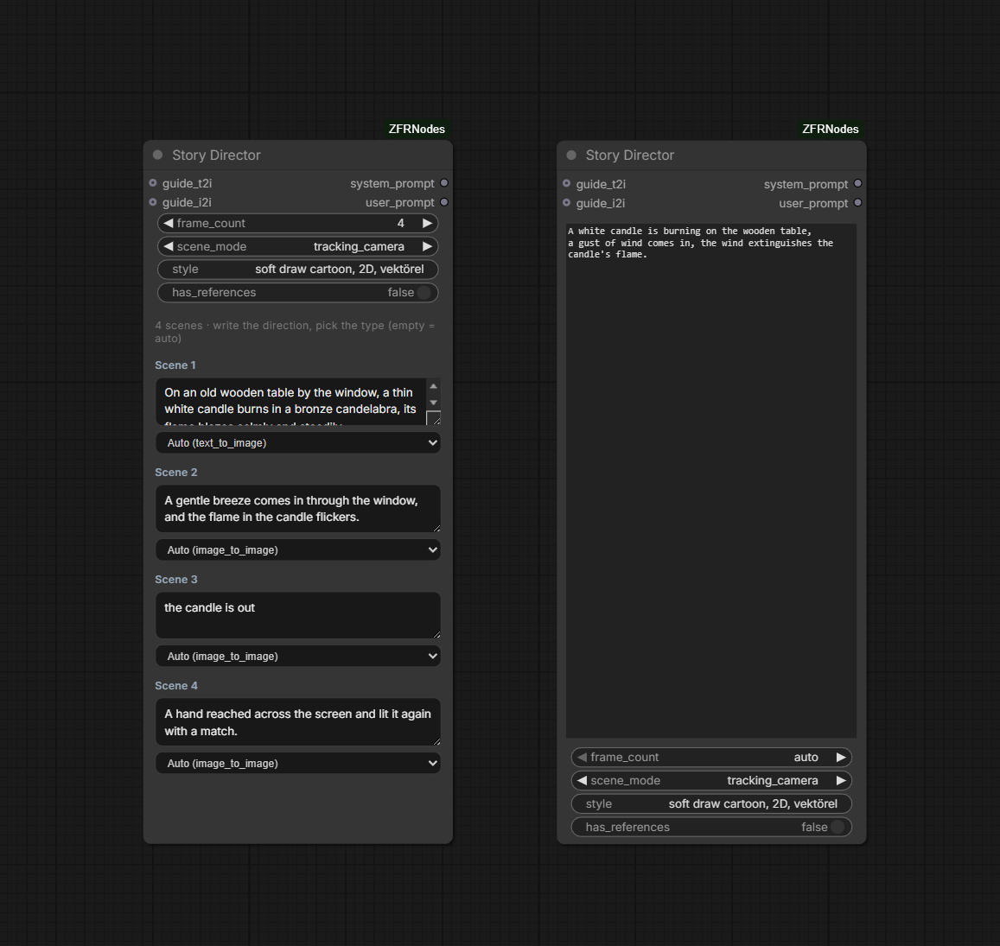
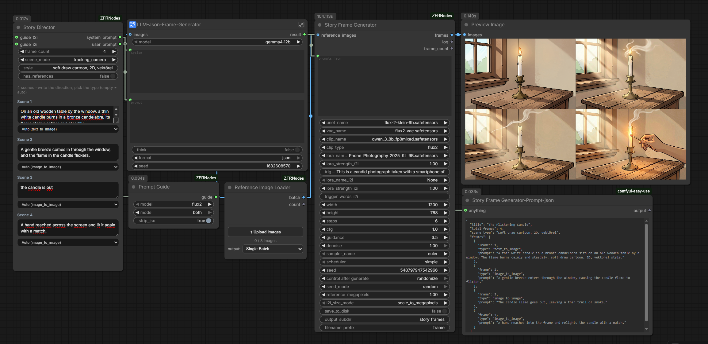
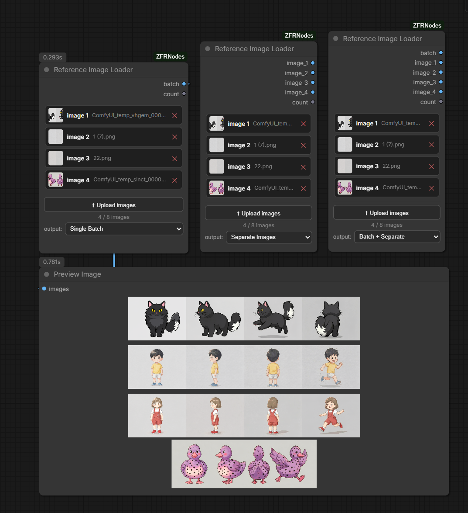
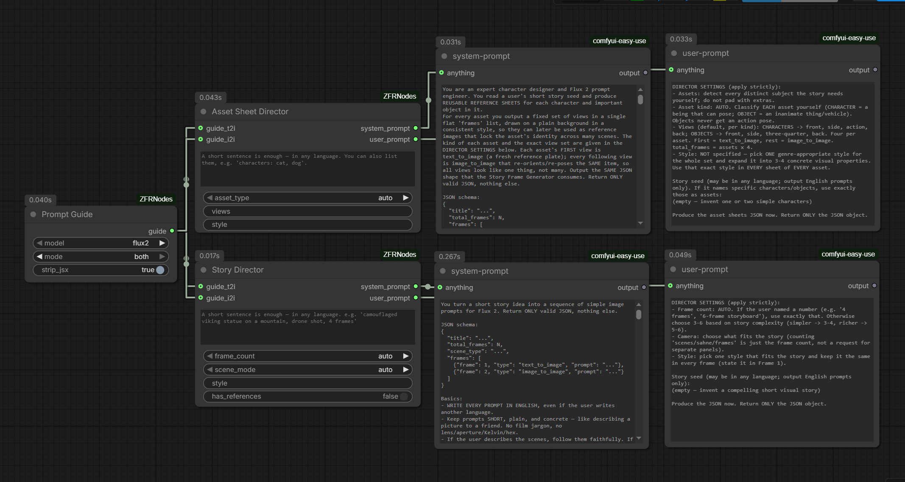

# ComfyUI-ZFRNodes

> Generate a **whole, consistent multi-frame story** from a single JSON prompt — in one node, one queue run.

ComfyUI custom nodes for **story / sequence image generation** and single-image
text-to-image + image-to-image, plus a few small type/JSON helper nodes.

The headline node, **Story Frame Generator**, takes a JSON describing a sequence of frames
(first a text-to-image shot, then image-to-image edits) and produces the entire chain
inside one node — each frame continuing from the previous one — so you don't need to wire
six samplers or queue the graph repeatedly.

---

| Story preview | Workflow |
| --- | --- |
|  |  |

---

## What's new in 1.1.0

This release turns the pack from "render a story JSON" into a full **idea → consistent visual story** pipeline. You can now write one short sentence (in any language) and let the nodes plan the prompts, lock character identity with reference sheets, and render the whole sequence.

**New nodes**

| Node | One-liner |
| --- | --- |
| **Story Director** | Turn a short idea (any language) into the exact system + user prompt an LLM needs to produce story JSON. Per-scene boxes, per-scene t2i/i2i type, reference awareness. |
| **Asset Sheet Director** | Build prompts for reusable **character / object reference sheets** (front / side / action / back, or your own custom views). |
| **Sheet Compositor** | Crop the generated sheets to their content and lay them out side by side into one clean **contact sheet**. |
| **Prompt Guide** | Pull model-specific prompting guides (`t2i` / `i2i` / `both`) straight from the bundled docs. |
| **Reference Image Loader** | Upload several reference images directly inside the node and output them as one IMAGE batch. |

**Improvements to existing nodes**

- **Simple Image Generator (Multiple)** — now takes **one batched `reference_images` input** (connect a Reference Image Loader directly) instead of wiring slots one by one. Added a reference **thumbnail preview**, `save_to_disk`, and aspect-preserving sizing (no stretch / squash / crop).
- **Story Frame Generator** — optional **`reference_images`** input: connect a contact sheet and every frame is conditioned on it, so character identity stays locked across the whole story.
- **All generators** — `clip_type` is now pulled **dynamically from ComfyUI** (≈23 types: `flux2`, `sd3`, `wan`, `qwen_image`, `hidream`, `chroma`, …) instead of a fixed 5-item list.

---

## Why this exists

ComfyUI's graph can't feed a node's output back into the next iteration within one run
(no feedback loops). So generating "frame N edits frame N-1" normally means either chaining
many samplers by hand or re-queuing with manual indexing. **Story Frame Generator runs the
loop *inside* the node**, keeping the resolution fixed across the chain to avoid the gradual
"fading"/drift you get when reference and sampler sizes drift apart.

## Nodes (category: `zfr-nodes`)

**Story / sequence generation**

| Node | What it does |
| --- | --- |
| **Story Frame Generator** | Reads frame JSON, generates the full sequence (t2i then chained i2i) in one node. Optional `reference_images` keeps character identity across frames. Returns all frames as one IMAGE batch and saves them to disk. |
| **Story Director** | Converts a short, free-text idea (any language) into the `system_prompt` + `user_prompt` an LLM needs to output valid story JSON. Dynamic per-scene boxes, per-scene t2i/i2i choice, reference-aware. |
| **JSON Frame Extractor** | Parses the frame JSON; outputs prompt lists, per-type counts, and human-readable preview strings for debugging. |

**Single image / references**

| Node | What it does |
| --- | --- |
| **Simple Image Generator** | Single image from a prompt. Optional `reference_image` switches it to image-to-image (edit) mode. |
| **Simple Image Generator (Multiple)** | Multi-reference version. Takes one batched `reference_images` input, splits it internally, and conditions on every reference at once. Works with zero references (text-to-image) too. |
| **Reference Image Loader** | Upload multiple reference images inside the node (no `Load Image` chains); outputs them as a single IMAGE batch + count. |

**Character / asset sheets**

| Node | What it does |
| --- | --- |
| **Asset Sheet Director** | Builds prompts for reusable character / object reference sheets (configurable views + asset type). |
| **Sheet Compositor** | Auto-crops generated sheets to their content and arranges them side by side into one contact sheet. |

**Helpers**

| Node | What it does |
| --- | --- |
| **Prompt Guide** | Loads bundled model-specific prompting docs by mode (`t2i` / `i2i` / `both`). |
| **Convert To Integer / Float / String / Boolean** | Small type-conversion utilities. |

## Requirements

- ComfyUI with Flux-style model support, ideally a Flux2-compatible build such as `flux-2-klein` (the image-to-image / reference path relies on Flux2's `ReferenceLatent`).
- Python packages: `numpy`, `torch`, `Pillow` (these are usually already installed by ComfyUI).
- A compatible diffusion model, VAE, and text encoder for the chosen `clip_type` (the `clip_type` list is pulled live from ComfyUI, so all supported types show up automatically).
- For LLM-driven prompt generation (Story Director / Asset Sheet Director), the ComfyUI Ollama node: https://github.com/stavsap/comfyui-ollama. A **vision-capable** model (e.g. `qwen3.5:9b`) is recommended if you want the LLM to read reference contact sheets.
- A `requirements.txt` file is included for quick dependency installation with `pip install -r requirements.txt`.

## Installation

### Via ComfyUI-Manager
Search for **ComfyUI-ZFRNodes** in the Manager and install, then restart ComfyUI.

### Manual install
Clone this repository into your ComfyUI `custom_nodes` directory:

```bash
cd /path/to/ComfyUI/custom_nodes
git clone https://github.com/zfrsgtcu/ComfyUI-ZFRNodes.git
```

If the directory already exists, update it instead:

```bash
cd /path/to/ComfyUI/custom_nodes/ComfyUI-ZFRNodes
git pull
```

Then **fully restart ComfyUI**. A browser refresh is not enough because the Python process caches loaded modules.

## Usage

This node collection is designed to make story-driven image generation easier in ComfyUI.

- Use `JSON Frame Extractor` to validate JSON prompts and preview detected text-to-image / image-to-image frames.
- Use `Simple Image Generator` when you want a single image from a prompt or a one-shot reference edit.
- Use `Story Frame Generator` when you want a full sequence of frames generated in one node run.

### Why this helps

You can give the system a natural-language directive instead of carefully engineering a prompt. With LLM-based workflows, the language model rewrites or expands your instruction into structured story/frame JSON, and the node then converts that JSON directly into visual scenes.

### Common use cases

- Storyboarding and visual narrative generation
- Concept art and scene composition
- Character progression or transformation sequences
- Marketing visuals, mood boards, and cinematic frames
- Reference-based editing and continuity between frames

### Full identity-locked story pipeline

For a story where the same character must stay consistent across every frame, the nodes chain like this:

```
1. Asset Sheet Director → Ollama → Story Frame Generator   →  character/object sheets
2. Sheet Compositor                                        →  one contact sheet
3. Story Director → Ollama (+ contact sheet) → Story Frame Generator (reference_images)
```

You only write a short idea. Step 1–2 build a reference sheet of your cast; step 3 plans the
story and renders it while every frame is conditioned on that sheet — so the character keeps
its look from start to finish. For a simpler run, skip steps 1–2 and use **Story Director →
Ollama → Story Frame Generator** on its own.

## Example workflows

Ready-to-use workflow files are in the [`workflows/`](workflows) folder. Each workflow is separate and can be loaded by dragging its `.json` onto the ComfyUI canvas.

- `ZFRNodes-LLM-Story-Generator.json` — Ollama generates story JSON, then `Story Frame Generator` renders the full sequence.
- `ZFRNodes-LLM-Simple-Generator.json` — Ollama generates a single natural prompt for `Simple Image Generator`.
- `ZFRNodes-Simple-Image-Generator.json` — plain text-to-image with `Simple Image Generator`.
- `ZFRNodes-Reference-Simple-Image-Generator.json` — reference image editing with `Simple Image Generator`.

## Ollama / LLM integration

Use Ollama to convert user-friendly directives into the prompt or JSON structure that the nodes need.

- ComfyUI Ollama node: https://github.com/stavsap/comfyui-ollama
- Ollama install guide: https://docs.ollama.com/
- Ollama Download Link : https://ollama.com/download

### Suggested Ollama install commands

For Windows, install Ollama from the official installer or using Winget if available:

```powershell
winget install --id Ollama.Ollama
```

Then pull a model:

```powershell
ollama pull llama2
```

Or choose another Ollama-supported model.

### How to use with this repo

1. Install the ComfyUI Ollama node.
2. Load `ZFRNodes-LLM-Story-Generator.json` or `ZFRNodes-LLM-Simple-Generator.json`.
3. Enter a natural instruction such as a story description or scene directive.
4. Let Ollama generate the story / prompt JSON.
5. The node collection turns that JSON into one or more final images.

### Example prompts

- `Create a dramatic fantasy scene of a knight entering a glowing crystal cave at sunset, then transition to the knight drawing a sword as shadow creatures approach.`
- `Generate a futuristic street scene with neon signs, rain, and a lone detective, then show the detective discovering a holographic clue.`
- `Turn this into a sequence: first a cozy library interior, then a magical book opening and releasing floating runes.`

---

## JSON Frame Extractor


Parses the JSON and separates prompts so you can verify what was detected.

- `text_to_image_prompts`, `image_to_image_prompts` (STRING **lists**, `OUTPUT_IS_LIST`).
- `text_to_image_count`, `image_to_image_count`, `total_frames` (INT).
- `text_to_image_preview`, `image_to_image_preview` (STRING) — all prompts in one numbered
  block with a count header.

> For debugging, connect the **`*_preview`** outputs to a Show Text node. The `*_prompts`
> list outputs get iterated by ComfyUI when wired into a non-list node (so it looks like only
> the last prompt shows). The preview strings grow dynamically with however many frames the
> JSON contains — no fixed limit.

---

## Simple Image Generator


Single-image generator for ComfyUI with two modes in one node:

- Text-to-image when `reference_image` is not connected.
- Image-to-image editing when `reference_image` is connected.

The node uses the same Flux2-style conditioning logic as `Story Frame Generator`, but
for a single prompt and optional reference image. It loads the selected UNET, VAE, and CLIP
once, applies an optional LoRA, and generates either a fresh image or an edit of the
reference image.

| Text-to-image | Image-to-image (with reference) |
| --- | --- |
|  |  |

- **No `reference_image`** → text-to-image: empty latent + denoise 1.0, output at `width`×`height`.
- **`reference_image` connected** → image-to-image: reference is VAE-encoded and injected into
  positive conditioning via `ReferenceLatent`, then a new image is sampled.

Inputs:
- `prompt`
- `unet_name`, `vae_name`, `clip_name`, `clip_type`
- `lora_name`, `lora_strength`, `trigger_words`
- `width`, `height`, `steps`, `cfg`, `guidance`, `sampler_name`, `scheduler`
- `seed`, `seed_mode`
- optional `reference_image`, `reference_megapixels`, `reference_size_mode`

Outputs:
- `image`
- `log`

---

## Simple Image Generator (Multiple)

The multi-reference version of **Simple Image Generator**. Everything is identical —
same Flux2-style conditioning, same loaders, same sampler settings — except it can take
**several reference images at once** (up to 8) instead of just one.

| Node |
| --- |
|  |

It takes **one batched `reference_images` input**: connect a [Reference Image Loader](#reference-image-loader)
(or any IMAGE batch) and the node splits it internally into `image 1, image 2, …` — no
slot-by-slot wiring. After a run, a small **thumbnail strip** of the references used is
shown at the top of the node. With nothing connected it behaves as a plain
text-to-image generator.

### How it differs from Simple Image Generator

- **`Simple Image Generator`** has one fixed `reference_image` input → one mode switch (text-to-image vs. single-reference edit).
- **`Simple Image Generator (Multiple)`** takes one `reference_images` IMAGE **batch** and splits it internally (up to 8), so you connect a single wire instead of managing eight slots.
- **Every** reference is VAE-encoded and appended to the positive conditioning as its own `ReferenceLatent`, so the model can condition on all of them at once (Flux2 multi-reference editing).
- **Aspect-preserving sizing** — `match_first_reference` or `fit_to_width_height`; references are scaled with their aspect ratio kept (no stretch / squash / crop).
- Adds **`save_to_disk` / `output_subdir` / `filename_prefix`** for writing the result straight to disk.
- Otherwise the inputs/outputs (`prompt`, model loaders, LoRA, `width/height`, `steps`, `cfg`, `guidance`, `denoise`, `sampler_name`, `scheduler`, `seed`, `image`, `log`) are the same as `Simple Image Generator`.

> **Note:** the node's UI (thumbnail strip, output-mode select) is added by a frontend script, so it needs a **full ComfyUI restart** (not just a browser refresh) after installing/updating, so `web/zfrnodes.js` is registered.

### Examples

The screenshots below show the node driven by an LLM-generated prompt, taking product /
character reference photos and compositing them into a single result.

| Example |
| --- |
|  |

**Full pipeline — reference images → LLM prompt → result.** On the left, two `Load Image`
nodes feed reference photos (a face/character and a product) into the dynamic reference
slots. An LLM (`LLM-Image-For-Prompt-Generator`) writes a detailed prompt describing how
the references should be combined, that prompt drives **Simple Image Generator (Multiple)**,
and the node returns a single composited image on the right. This is the typical use case:
let the language model describe the scene while the node grounds it in your real reference
photos.

| Example |
| --- |
|  |

**Reference-grounded product/character shot.** The same setup with the model holding the
referenced product. Because each reference is injected as its own `ReferenceLatent`, the
output keeps the subject's identity *and* the product's appearance from the separate
reference photos — useful for marketing visuals, product placement, character + prop
continuity, and mood boards where several real inputs must appear together in one generated
frame.

---

## Story Frame Generator


Reproduces, in pure Python, a text-to-image + chained image-to-image workflow (Flux2-style
reference-latent editing), so an entire story is produced from one node in a single run.

### Expected JSON

```json
{
  "title": "The Awakening Cat",
  "total_frames": 4,
  "frames": [
    {
      "frame": 1,
      "type": "text_to_image",
      "prompt": {
        "Subject": "A sleek black cat asleep on a burgundy velvet cushion...",
        "Style": "Hyper-realistic documentary photography",
        "Lighting": "Soft morning sunlight from the right"
      }
    },
    {
      "frame": 2,
      "type": "image_to_image",
      "prompt": "Change the cat's posture from asleep to stretching. Preserve everything else."
    }
  ]
}
```

- `text_to_image` frames may use a `prompt` **object** (joined into `key: value` lines) or a plain string.
- `image_to_image` frames use a plain `prompt` **string**.

### Inputs

- `prompts_json` — the frame JSON (string or text node).
- `unet_name`, `vae_name`, `clip_name`, `clip_type` — model loaders. **Pick names/type that
  match the model you use** — a mismatched model/type errors inside sampling.
- `lora_name_t2i`, `lora_strength_t2i`, `trigger_words_t2i` — LoRA / strength / trigger words for the first (text-to-image) frame.
- `lora_name_i2i`, `lora_strength_i2i`, `trigger_words_i2i` — a **separate** LoRA / strength / trigger words for the image-to-image frames.
- `width`, `height` — first-frame size (default 960×1200).
- `steps`, `cfg`, `guidance`, `sampler_name`, `scheduler` — sampler settings (defaults: 8 / 1.0 / 3.5 / euler / simple).
- `seed`, `seed_mode` — `fixed`, `increment`, or `random` per frame.
- `reference_megapixels` — reference size for the `scale_to_megapixels` mode (default 1.0 MP).
- `i2i_size_mode` — `scale_to_megapixels` (default) or `match_first_frame` (see *Resolution stability*).
- *(optional)* `reference_images` — an IMAGE batch (e.g. a contact sheet from **Sheet Compositor**). When connected, **every frame** is additionally conditioned on these references, so character identity stays consistent across the whole sequence. Leave it empty for the original reference-free behavior.
- `save_to_disk`, `output_subdir`, `filename_prefix` — disk output (default `output/story_frames/frame_###.png`).

### Outputs

- `frames` — all frames as one IMAGE batch (→ Preview / Save Image). Normalized to the first frame's size before batching.
- `log` — per-frame log (mode, resolution, seed).
- `frame_count` — number of frames generated.

---


### How the chain works

1. First frame (`text_to_image`): empty latent + denoise 1.0 → first image.
2. Following frames (`image_to_image`): the previous frame is VAE-encoded and injected into
   the positive conditioning via `ReferenceLatent`; a new image is generated that continues
   from the previous one.

Models, CLIP, and VAE are loaded **once** and reused across all frames. Empty latents use
ComfyUI's own `EmptyLatentImage` so channel count / device / dtype match the host workflow.

### Resolution stability (avoiding drift)

Quality drift / a "fading" look after a few frames is almost always the sampler's target
latent size not matching the reference latent size. To prevent it, the i2i frame size is
decided **once** and held **constant** for the rest of the chain:

- `scale_to_megapixels` (default): first i2i frame scales the reference to `reference_megapixels`; that size is locked for all later i2i frames.
- `match_first_frame`: i2i frames reuse the first frame's `width`×`height`.

### LoRAs and trigger words

t2i and i2i each have their own LoRA, strength, and trigger words, so they can use entirely
different LoRAs. Trigger words are prepended to that frame's prompt (`trigger, <prompt>`)
before encoding — how LoRAs that need activation keywords get triggered. Leave a trigger
empty to add nothing; set a LoRA to `None` to run that stage without one.

---

## Story Director

Writes the **prompts for the prompt writer**. You give a short idea; Story Director outputs
a clean `system_prompt` + `user_prompt` for an LLM (e.g. Ollama) so the model returns valid
story JSON that **Story Frame Generator** can render directly. No prompt-engineering required.

| Node UI | Output (system + user prompt) |
| --- | --- |
|  |  |

### Inputs

| Input | Purpose |
| --- | --- |
| `user_input` | Your idea — a single short sentence, in **any language** (output prompts are always English). Used when `frame_count = auto`. |
| `frame_count` | `auto` (LLM decides) or a fixed number. Pick a number and **N per-scene boxes appear** below the node — one direction per frame. |
| `scene_mode` | `auto` / `static_camera` / `tracking_camera` / `orbiting_camera` / `cutscene` / `storyboard` — guides how the shots are staged. |
| `style` | Leave empty (LLM chooses) or set one, e.g. `anime`, `noir`, `comic book`. |
| `has_references` | Turn **on** when you've connected a reference image to your Ollama node, so the LLM refers to subjects as "the cat in Picture 1" instead of describing them. |
| *(optional)* `guide_t2i`, `guide_i2i` | Connect **Prompt Guide** outputs to ground prompt wording in model-specific docs. |

### Per-scene boxes

When `frame_count` is a fixed number, each scene gets its own text box **and a t2i/i2i type
select** (`Auto` keeps the standard layout: frame 1 = text_to_image, the rest = image_to_image;
or force a type per scene). Leave the type on `Auto` and just write the action — or mix types
freely. The node packs everything into the `user_prompt` so the LLM produces exactly that
many frames, in order.

### Outputs

- `system_prompt` → your Ollama node's **system** input.
- `user_prompt` → your Ollama node's **prompt** input.

> Story Director only writes text — it never calls a model itself. Wire its outputs into an
> Ollama (or any LLM) node, set the LLM output format to JSON, then feed the result into
> **Story Frame Generator**.

---

## Reference Image Loader

Upload reference images **inside the node** — no chains of `Load Image` nodes. Pick several
files, see them as a compact thumbnail table, reorder/remove, and the node outputs them as a
single IMAGE **batch** ready for the multi-reference generators.



- "⬆ Upload images" button → choose one or many files (max 8).
- Each upload appears as `image 1, image 2, …`; click a row to expand/collapse the preview.
- **Output mode** select: `Single Batch`, `Separate Images`, or `Batch + Separate`.
- Outputs a `batch` IMAGE and a `count`. Different-sized images are combined without cropping
  or stretching (transparent letterbox), so the batch stays consistent.

Typical wiring: **Reference Image Loader → Simple Image Generator (Multiple)** (`reference_images`),
or **→ Story Frame Generator** (`reference_images`).

---

## Asset Sheet Director & Sheet Compositor

These two build **reusable character / object reference sheets** so a subject looks the same
across an entire story.

**Asset Sheet Director** writes prompts (system + user) for an LLM to output sheet JSON. For
each detected character/object it produces a set of views — the first is `text_to_image`
(a clean reference plate on a plain grey background) and the rest are `image_to_image` edits
that rotate/re-pose the *same* individual, so all views look like one subject.

| Input | Purpose |
| --- | --- |
| `user_input` | The subject(s) — any language. e.g. `characters: cat, dog`. |
| `asset_type` | `auto` (LLM classifies each) / `character` / `object`. |
| `views` | Empty = default (character: front, side, action, back · object: front, side, three-quarter, back) — or your own comma-separated list, any number. |
| `style` | Empty (LLM chooses) or a named style. |
| *(optional)* `guide_t2i`, `guide_i2i` | Prompt Guide grounding. |

**Sheet Compositor** takes the rendered sheet images (an IMAGE batch), detects each figure
against the plain grey background, **crops to content**, scales them to a common height, and
lays them side by side into one tidy **contact sheet** — ideal as a single reference image
for **Story Director** (`has_references = true`) + **Story Frame Generator** (`reference_images`).

| Input | Purpose |
| --- | --- |
| `sheets` | IMAGE batch of generated sheets. |
| `row_height` | Common height all figures are scaled to. |
| `spacing` | Gap between figures and around the edges. |
| `padding_pct` | Small margin kept around each detected figure. |
| `bg_threshold` | How far a pixel must differ from `#d9d9d9` to count as foreground. |

---

## Prompt Guide

Loads the bundled **model-specific prompting guides** so you (or an LLM) write prompts the way
each model expects. Pick a model folder and a mode; the node concatenates the matching
markdown docs into one STRING.



| Input | Purpose |
| --- | --- |
| `model` | Auto-listed from `docs/models/` (e.g. `flux2`, `sdxl`, `sd15`, `pony`, `z-image`). |
| `mode` | `t2i`, `i2i`, or **`both`** (returns the text-to-image and image-to-image guides together, labeled). |
| `strip_jsx` | Removes JSX/React snippets from the docs, leaving clean readable guidance. |

Connect the `guide` output to **Story Director** / **Asset Sheet Director** (`guide_t2i` /
`guide_i2i`) to ground their wording in the chosen model's documentation.

---

## Notes / compatibility

- Built and tested with **Flux2 (flux-2-klein)** + a Qwen text encoder (`clip_type = flux2`).
  The image-to-image path relies on `ReferenceLatent`, so models that support reference-latent
  conditioning work best. Other models may need a different `clip_type` / may not support i2i.
- After each frame the node frees intermediate tensors and calls `soft_empty_cache()`, and
  finished frames are moved to CPU/RAM — keeping long sequences from running out of VRAM.
- All nodes load from the `py` subpackage; `any_type.py` provides the wildcard type the
  converters use.

## License

[MIT](LICENSE) © Zafer Söğütcü
